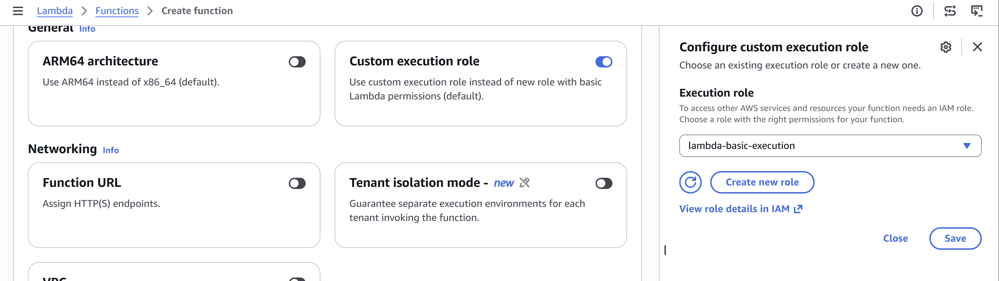
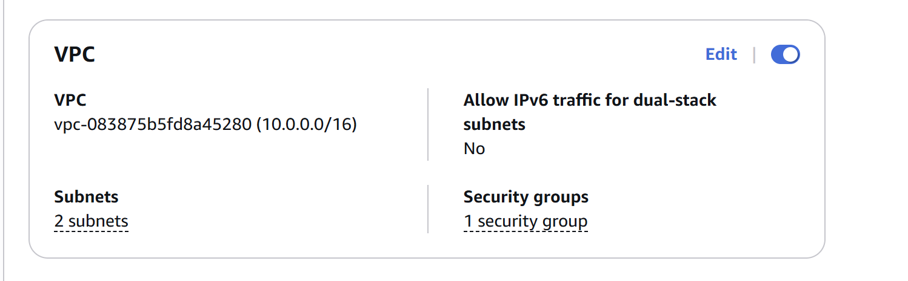
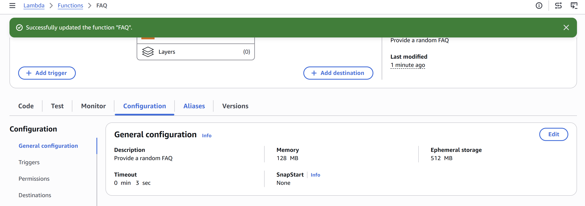
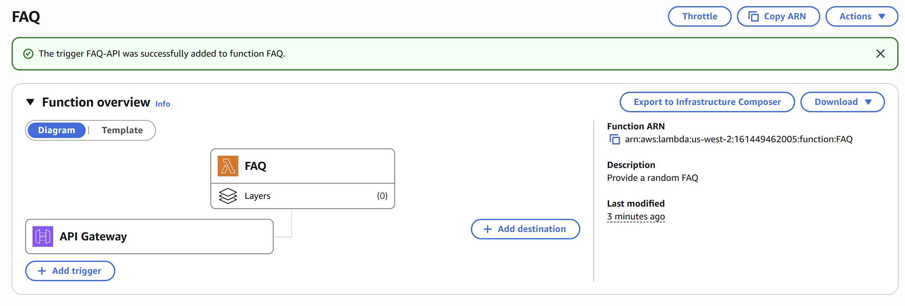
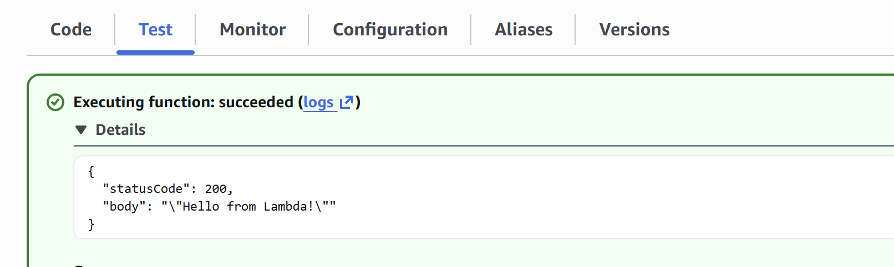

# Amazon API Gateway
Dịch vụ quản lý của AWS giúp tạo, deploy và duy trì API dễ dàng.
Các tính năng chính:
- Thay đổi (transform) body và header của request/response cho khớp với backend hoặc client.
- Kiểm soát quyền truy cập API bằng IAM.
- Tạo API key cho dev bên thứ ba.
- Tích hợp CloudWatch để theo dõi và giám sát API.
- Cache phản hồi qua CloudFront để tăng tốc độ phản hồi.
- Deploy API lên nhiều stage (dev, test, prod) và quản lý version.
- Kết nối custom domain cho API.
- Định nghĩa các models để chuẩn hóa request/response.

# AWS Lambda
Dịch vụ tính toán serverless chạy code dựa trên sự kiện (event-driven), không cần quản lý server và chỉ trả phí khi sử dụng.

Các tính năng chính:
- Thêm logic tùy biến cho dịch vụ AWS hoặc xây dựng backend riêng.
- Chạy code tự viết hoặc đóng gói dưới dạng container image.
- Tự động scale và tích hợp sẵn khả năng chịu lỗi.
- Kết nối database quan hệ hoặc shared file system.
- Quản lý bảo mật bằng IAM và tích hợp với các công cụ giám sát/monitoring.

task 1: tạo lambda function
- task 1.1: cấu hình lambda ban đầu
  - tạo function tên 'FAQ', runtime Node.js 22.x
  - bật Custom execution role, chọn role: 'lambda-basic-execution'
  
  - cấu hình VPC:
    - VPC: 10.0.0.0/16
    - Subnets: chọn cả hai subnet 10.0.1.0/24 và 10.0.2.0/24
    - Security group: chọn nhóm có chứa 'LambdaSecurityGroup'

  - vào tab Code, sửa file index.js: paste code trả về FAQ ngẫu nhiên (có sẵn trong đề lab) rồi click Deploy
- task 1.2: tạo endpoint api gateway làm trigger
  - trong tab Configuration -> General configuration, sửa Description thành 'Provide a random FAQ'
  
  - ở phần Function overview, chọn Add trigger:
    - Source: API Gateway
    - Intent: Create a new API
    - API type: REST API
    - Security: Open
    - API name: FAQ-API
    - Deployment stage: myDeployment
    - click Add

task 2: test lambda function
- test qua trình duyệt: vào tab Configuration -> Triggers -> API Gateway, copy API endpoint rồi dán lên trình duyệt để kiểm tra kết quả trả về FAQ ngẫu nhiên

- test trong console:
  - sang tab Test, tạo test event tên 'BasicTest' với JSON rỗng '{}'
  - click Test để kiểm tra kết quả trả về trực tiếp
  - vào tab Monitor -> View CloudWatch logs để check logs chi tiết nếu cần
