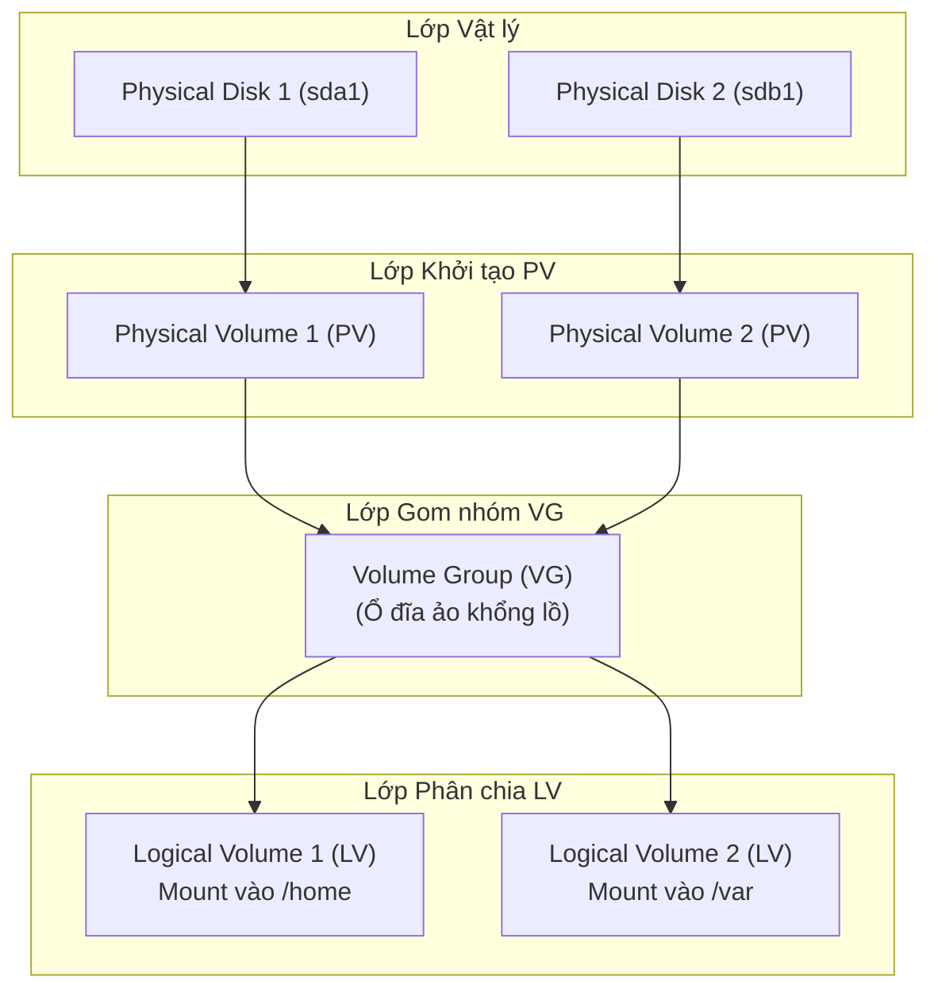

# Phần 5: Thiết kế phân vùng ổ cứng trên Linux

Tài liệu này trình bày về cấu trúc các thư mục chính trong hệ thống file Linux, bộ nhớ Swap (Swap Space), các câu lệnh quản lý phân vùng và mount ổ đĩa, cùng với giải pháp quản lý ổ đĩa linh hoạt LVM (Logical Volume Manager).

---

## 1. Cấu trúc thư mục chính trong Linux File System

Hệ thống file của Linux được sắp xếp theo cấu trúc cây phân cấp ngược, bắt đầu từ gốc là `/`. Dưới đây là các thư mục quan trọng cần lưu ý khi thiết kế phân vùng:

- **`/` (Root)**: Thư mục gốc, nằm ở vị trí dưới cùng của cây thư mục. Mọi file và thư mục khác đều bắt đầu từ đây.
- **`/var` (Variable data)**: Chứa các dữ liệu thường xuyên thay đổi trong quá trình hệ thống vận hành, bao gồm log files (`/var/log`), spool directories, database, và nội dung động của các trang web (ví dụ: mã nguồn website chạy web server).
- **`/home` (User homes)**: Chứa thư mục cá nhân của người dùng thông thường, lưu trữ các file cấu hình riêng, tài liệu và dữ liệu cá nhân (Ví dụ: `/home/phuonglh`).
- **`/opt` (Optional software)**: Dành riêng cho việc cài đặt các ứng dụng bổ sung hoặc phần mềm từ bên thứ ba (optional/add-on software packages). Thư mục này rất thường được sử dụng trong môi trường doanh nghiệp để cài đặt các phần mềm đặc thù.

---

## 2. Bộ nhớ ảo Swap (Swap Space)

Swap là vùng không gian trên ổ cứng vật lý được sử dụng làm bộ nhớ đệm tạm thời để hỗ trợ cho RAM vật lý.

### Nguyên lý hoạt động:
- Khi RAM vật lý bị đầy ở một tỷ lệ phần trăm nhất định, Linux Kernel sẽ quét và chuyển các trang dữ liệu ít được sử dụng nhất (idle pages) từ RAM sang phân vùng Swap để giải phóng không gian cho các tiến trình đang cần gấp.

### Các dạng cấu hình Swap:
- **Swap Partition (Phổ biến nhất)**: Một phân vùng chuyên dụng trên ổ cứng được định dạng riêng làm Swap. Dạng này cho hiệu năng tốt nhất.
- **Swap File**: Một file thông thường nằm trên phân vùng hệ thống được cấu hình làm Swap (tương tự như `pagefile.sys` trên Windows). Ưu điểm là dễ dàng thay đổi dung lượng mà không cần chia lại ổ cứng, nhưng hiệu suất vào ra (I/O) thường chậm hơn so với Swap Partition.

### Tính toán dung lượng (Sizing):
- **Trước đây (Hệ thống Linux cũ)**: Quy tắc phổ biến là đặt dung lượng Swap gấp **1.5x đến 2.0x** lần dung lượng RAM vật lý.
- **Hiện nay**: Do dung lượng RAM vật lý trên các máy chủ hiện đại rất lớn, việc cấu hình Swap hoàn toàn tùy thuộc vào quản trị viên. Khuyến nghị thông thường là nên để dung lượng Swap **dưới 50%** dung lượng RAM vật lý để tối ưu hiệu năng tổng thể của hệ thống.

---

## 3. Các câu lệnh quản lý phân vùng và Mount ổ cứng

Để làm việc với các phân vùng ổ cứng, chúng ta sử dụng nhóm lệnh sau:

*   **`mount`**: 
    - Dùng để mount (gắn) một phân vùng ổ cứng vào một thư mục trống trong hệ thống để truy cập dữ liệu.
    - Nếu chạy lệnh `mount` không kèm theo tham số nào, hệ thống sẽ hiển thị danh sách tất cả các phân vùng và thiết bị hiện đang được mount trong hệ điều hành.
*   **`lsblk`**: Hiển thị thông tin tổng quan dưới dạng sơ đồ cây về tất cả các thiết bị khối (block devices) như ổ đĩa và phân vùng hiện có.
*   **`fdisk -l /dev/<disk_name>`**: Hiển thị danh sách các phân vùng chi tiết và bảng phân vùng trên một ổ đĩa cụ thể (Ví dụ: `fdisk -l /dev/sda`).
*   **`swapon --summary`**: Hiển thị bảng tổng kết về dung lượng và tình trạng sử dụng hiện tại của bộ nhớ Swap (tương tự như việc xem file `/proc/swaps`).

---

## 4. LVM (Logical Volume Manager) - Trình quản lý ổ đĩa logic

LVM là một cơ chế quản lý ổ đĩa rất mạnh mẽ và linh hoạt trong Linux, cho phép gom nhóm nhiều ổ đĩa cứng vật lý hoặc các phân vùng vật lý lại với nhau để quản lý tập trung và chia nhỏ thành các phân vùng ảo.

### Các đặc điểm chính:
- **Áp dụng:** Có thể sử dụng LVM cho hầu hết các mount point (thư mục được mount) trong hệ thống, ngoại trừ thư mục boot chính `/boot` (vì bootloader cần truy cập trực tiếp để nạp kernel trước khi driver LVM được tải).
- **Tính linh hoạt (Flexibility):** Cho phép dễ dàng thay đổi kích thước (resizing - mở rộng hoặc thu nhỏ) của các logical volumes mà không cần định dạng lại hay làm gián đoạn hệ thống.
- **Snapshots:** Hỗ trợ tạo bản sao đóng băng (copy-on-write snapshot) của logical volume tại một thời điểm nhất định, cực kỳ hữu ích cho việc sao lưu dữ liệu (backup) nhanh chóng.

### Cấu trúc 3 lớp của LVM:

1.  **Physical Volume (PV)**: Là một ổ đĩa cứng vật lý hoặc một phân vùng (partition) vật lý thông thường đã được khởi tạo để sẵn sàng tham gia vào hệ thống LVM.
2.  **Volume Group (VG)**: Là một nhóm tập hợp của một hoặc nhiều Physical Volumes. Nó hoạt động như một ổ đĩa ảo khổng lồ đại diện cho tổng dung lượng của các PV thành viên.
3.  **Logical Volume (LV)**: Là các phân vùng ảo được cắt ra từ Volume Group. Đây là các ổ đĩa logic cuối cùng mà người dùng có thể định dạng hệ thống file (ext4, xfs...) và tiến hành mount vào các thư mục để sử dụng.

### Các lệnh kiểm tra thông tin LVM:
- **`pvs`**: Hiển thị thông tin tóm tắt về các ổ đĩa/phân vùng vật lý (Physical Volumes) hiện có.
- **`vgs`**: Hiển thị thông tin tóm tắt về các nhóm ổ đĩa (Volume Groups).
- **`lvs`**: Hiển thị danh sách các phân vùng ảo (Logical Volumes) đã được tạo ra.
