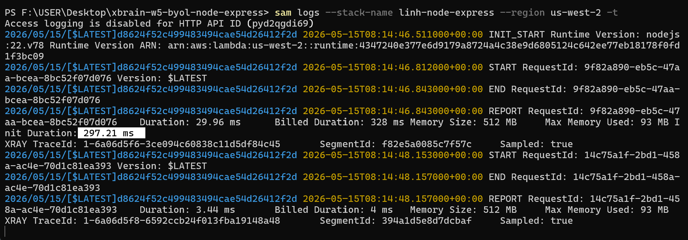
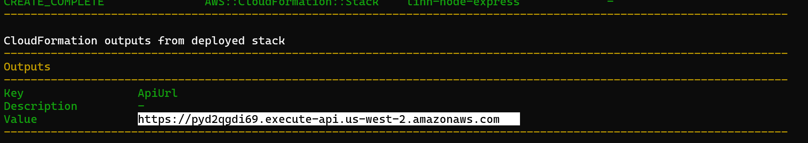
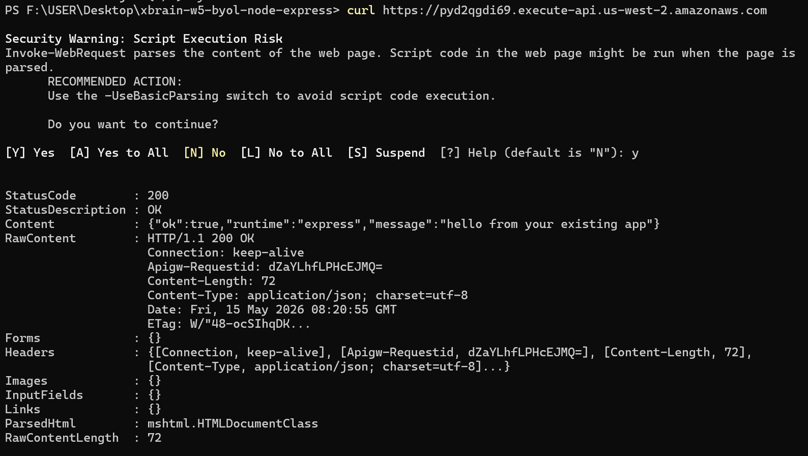
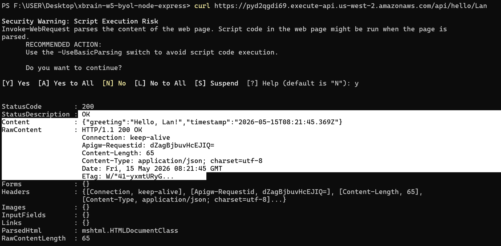
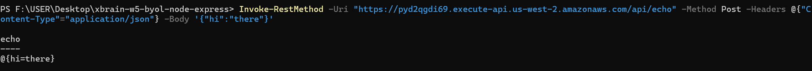

# BYOL Node.js Express - AWS Lambda Migration Notes

## 1. Chiến lược đã chọn

**Chiến lược A: `serverless-http` adapter**

## 2. Lý do chọn chiến lược này

- **Đơn giản và phổ biến:** `serverless-http` là một trong những thư viện adapter phổ biến nhất để bọc (wrap) một ứng dụng Express thuần túy và chạy trên môi trường AWS Lambda.
- **Chi phí thay đổi code thấp (Code-change cost):** Chỉ cần thêm 1 file entry point (`lambda.js` với 3 dòng code) và thêm 1 dependency (`serverless-http`) trong `package.json`.
- **Đảm bảo tính tách biệt (Pedagogy):** Mã nguồn chính của ứng dụng Express (`app.js`) không cần phải thay đổi hay biết về sự tồn tại của môi trường Lambda. Điều này giúp ứng dụng vẫn có thể chạy bình thường trên local (`server.js`) hoặc bất kỳ môi trường Node.js truyền thống nào.
- **Cold start ổn định:** Mức cold start ước tính khoảng 200-400ms, phù hợp với các ứng dụng Express thông thường.

## 3. Cold Start đo được (Init Duration)

- **Init Duration:** 297.21 ms
  

## 4. Tổng kết về Lambda

- **Execution Time:** trung bình ~10-20ms

APi GW:

test api gw:

- curl https://pyd2qgdi69.execute-api.us-west-2.amazonaws.com
  
- curl https://pyd2qgdi69.execute-api.us-west-2.amazonaws.com/api/hello/Lan
  

- Invoke-RestMethod -Uri "https://pyd2qgdi69.execute-api.us-west-2.amazonaws.com/api/echo" -Method Post -Headers @{"Content-Type"="application/json"} -Body '{"hi":"there"}'
  

