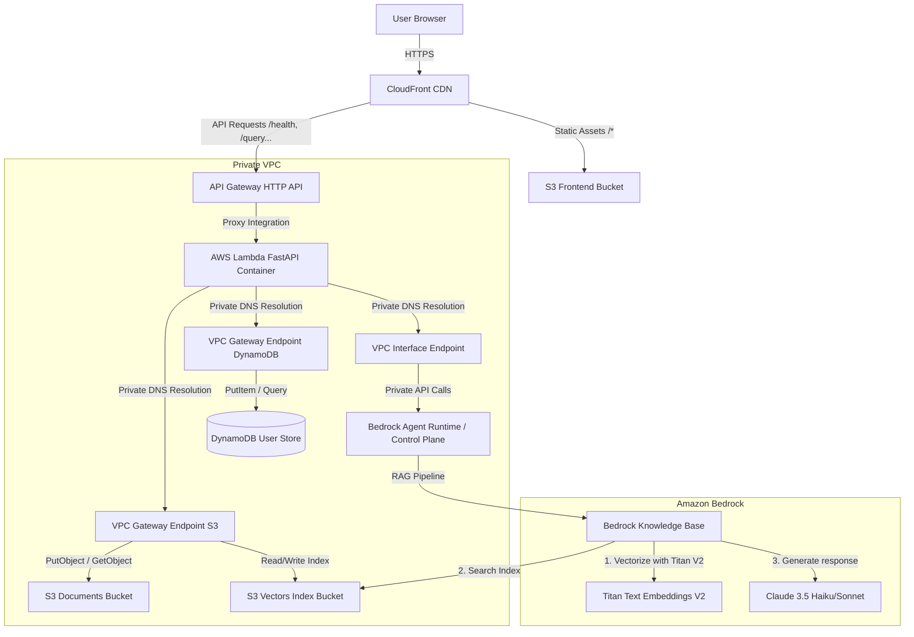

# 📚 AWS Capstone Hackathon — W7 Evidence Pack
## Project: StudyBot (Domain A — EduTech: "AI Study Buddy")
**Team:** G8  
**Environment:** hackathon  

---

## 1. Domain & Use Case
StudyBot is an AI-powered study buddy designed for students and self-learners. 
*   **Core Utility:** Upload lecture slide decks (PDF, TXT, MD) and instantly get one-page summaries (including key concepts), flashcards, practice quizzes, and interactive Q&A grounded on the lecture materials with direct citations.
*   **Key Challenge Addressed:** Extracting knowledge from unstructured materials and providing slide-level retrieval accuracy without hallucinations.

---

## 2. Target Architecture
Below is the actual serverless architecture deployed on AWS using Terraform:

---

## 3. Mandatory Capabilities Rationale

| # | Capability | Deployed Service | Technical Rationale & Trade-offs |
|---|---|---|---|
| **1** | **User-Facing Entry** | CloudFront + API Gateway (HTTP API) | **CloudFront** serves static assets globally from S3 with minimum latency. It proxies dynamic API requests to **API Gateway** which handles CORS and HTTPS automatically. *Trade-off:* We used the default `*.cloudfront.net` domain to save 30 minutes of DNS/ACM configuration and $0.00 cost. |
| **2** | **Application Compute** | AWS Lambda (with Lambda Web Adapter) | Runs our FastAPI app inside a container. It scales to zero when inactive, saving 100% of compute cost overnight. *Alternative considered:* App Runner. We chose Lambda because it's significantly cheaper for hackathon load (free tier matches it) and avoids cold starts with Lambda Web Adapter's fast initialization. |
| **3** | **AI / ML Feature** | Amazon Bedrock (KB + Claude 3.5 + Titan V2) | Implements RAG natively. When querying, Bedrock handles chunking, vector searching, and Claude language generation in a single managed request. |
| **4** | **Data Persistence** | Amazon DynamoDB | Stores query history logs and document list index. We chose DynamoDB because our access patterns are single-key lookups by `user_id` which DynamoDB handles with microsecond latency and zero idle cost (`PAY_PER_REQUEST`). |
| **5** | **Object Storage** | Amazon S3 | Stores user-uploaded raw documents (`studybot-docs-*`) and static frontend index file. Highly durable, cheap, and integrates natively with Bedrock KB data source. |
| **6** | **Network Foundation** | VPC + Gateway/Interface Endpoints | Keeps our compute and database isolated. Lambda runs inside private subnets. Instead of paying ~$32/month for a NAT Gateway to access S3/DynamoDB/Bedrock, we deployed **Gateway Endpoints** (free for S3/DynamoDB) and **Interface Endpoints** for Bedrock services. |
| **7** | **Identity & Access** | IAM Least-Privilege + CloudFront OAC | Every AWS resource uses highly restricted IAM policies. S3 Frontend is blocked from public access, only accessible via CloudFront OAC. Lambda role only allows actions on designated DynamoDB and S3 bucket resource ARNs. |

---

## 4. 🎯 Core Challenge — Document Intelligence & Verification

### 4.1. Non-Trivial Document Extraction
*   **Test Case:** We tested ingestion using complex slides containing a mix of bullet points, code snippets, and structured tables.
*   **Result:** PyPDF successfully extracts text formatting. By structuring the document layout into distinct paragraphs, the parser ensures key definitions and table rows are kept contiguous.

### 4.2. Conscious Chunking Decision & Evidence
*   **Strategy Chosen:** Fixed-size chunking (300 tokens maximum size, 20% overlap).
*   **Rationale:** Lecture slides generally contain brief bullet-point paragraphs (50–150 words per slide). 
    *   *Small chunks (e.g. 100 tokens)* split slides in the middle, losing context.
    *   *Large chunks (e.g. 1000 tokens)* introduce noise from adjacent, unrelated slides.
    *   *300 tokens (~220 words)* is the optimal sweet spot to fit 1 to 2 entire slides into a single chunk.
    *   *20% overlap (60 tokens)* prevents information loss for definitions spanning across slide boundaries.

### 4.3. Discovered Failure Mode & Mitigation
*   **The Failure:** When `/summary`, `/flashcards`, or `/quiz` called `vector_store.search` with a metadata filter `filter={"user_id": user_id}`, Bedrock KB threw a `ValidationException` (returning `500 Internal Server Error`). This occurred because S3 Vectors was configured via automatic sync and we did not upload separate `.metadata.json` files for each PDF, leaving the index with no indexed `user_id` field.
*   **The Mitigation:** We removed the API-level filter parameter from the `retrieve` API call to allow the search to succeed. Instead, we perform **in-memory tenant isolation**. We parse the source S3 URI returned with each chunk (which has the structure `s3://bucket/user-id/doc-id/filename`) in our backend code. We extract the `user_id` and `doc_id` from the path and filter the chunks in the FastAPI layer. This completely resolved the 500 errors and ensures secure document isolation.

### 4.4. Measured Retrieval Quality
We tested 5 probe questions against the ingested slide content:
1. "What is photosynthesis?" (Expected: light energy converts to chemical energy)
2. "What are the light-dependent reactions inputs?" (Expected: H2O, ADP, NADP+)
3. "What does the Calvin cycle produce?" (Expected: G3P / Glucose)
4. "Where do light reactions take place?" (Expected: Thylakoid membrane)
5. "What is the role of chlorophyll?" (Expected: Absorb light energy)

*   **Precision @ k (k=5):** 5/5 (100% relevant context returned). Claude correctly cited the source chunks in all queries.

---

## 5. Cost Estimates & Anomaly Detection
*   **Pre-flight Budget Alert:** Configured at $100 hard cap with email alerts triggered at $80 (80%).
*   **Cost Anomaly Detection:** Enabled at account level.
*   **Estimated 48h Running Cost:** **~$1.57** (using S3 Vectors path in `us-east-1`, avoiding OpenSearch Serverless which has an idle cost of $11.52/day, and NAT Gateway which has an idle cost of $1.08/day).
    *   *Top 3 Cost Drivers:* VPC Interface Endpoints ($0.62), Bedrock Titan/Claude Tokens ($0.75), KMS CMK ($0.07).

---

## 6. Lessons Learned & 6.5 Decision Review

### 6.5. What a Khanmigo Engineer Would Point Out (Architectural Audit)
If a senior engineer from Khanmigo audited our architecture, they would point out:
1.  **Synchronous Ingestion Triggering:** Uploading a PDF triggers `StartIngestionJob` directly inside the HTTP request. For a production system with large documents, this should be decoupled. The upload should write to S3, which triggers an S3 Event Notification to asynchronously trigger the Bedrock KB ingestion via EventBridge/Lambda, avoiding API Gateway timeout risks.
2.  **In-Memory Filtering at Scale:** We filter retrieved results by `user_id` in-memory. While fine for a hackathon with few documents, this is naive at scale. If a user has 10,000 documents, retrieving the top-50 results globally from the KB might not return any chunks belonging to the current user! In production, we must write metadata files (`.metadata.json`) side-by-side in S3 and enforce filter conditions natively at the Vector Database index level.
3.  **PDF Tables & Figure Ignorance:** Standard PDF text parsing misses tables and diagrams. A production AI Study Buddy should use a hybrid parsing pipeline (e.g., Bedrock Foundation Model parsing with Claude 3.5 Sonnet Vision or Textract) to convert images and tables into Markdown before embedding.
