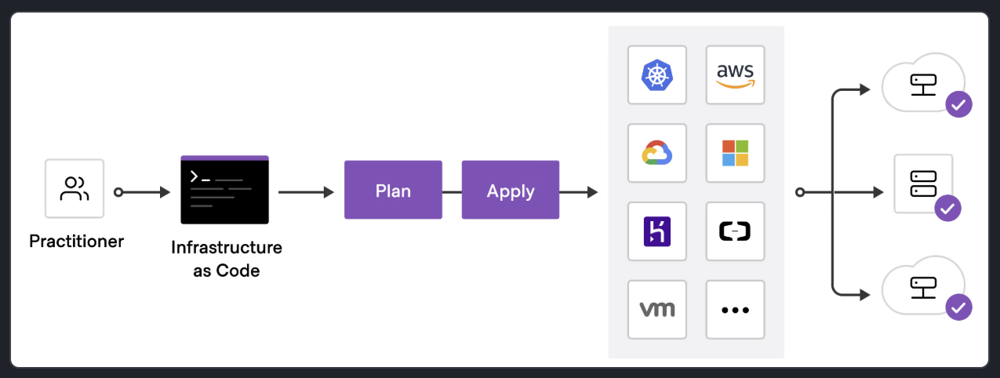

# 1. Infrastructure as Code (IaC) với Terraform

## 1.1. Infrastructure as Code (IaC) là gì?
- Là phương pháp quản lý và cấu hình hạ tầng bằng các **tệp cấu hình (configuration files)** thay vì thao tác thủ công qua giao diện đồ họa (GUI).
- Giúp xây dựng, thay đổi và quản lý hạ tầng một cách an toàn, nhất quán, có thể lặp lại, dễ dàng chia sẻ và quản lý phiên bản (version control).

## 1.2. Terraform là gì?
Terraform là công cụ IaC của HashiCorp giúp định nghĩa tài nguyên và hạ tầng dưới dạng các tệp cấu hình khai báo (declarative) thân thiện với con người, đồng thời quản lý toàn bộ vòng đời của hạ tầng.

### Ưu điểm của Terraform:
- **Quản lý đa nền tảng:** Quản lý hạ tầng trên nhiều đám mây (AWS, Azure, GCP, Kubernetes, v.v.) thông qua các plugin gọi là **Providers**.
- **Ngôn ngữ khai báo (Declarative):** Chỉ cần khai báo trạng thái mong muốn của hạ tầng, Terraform sẽ tự động tính toán thứ tự và cách thức tạo/hủy tài nguyên.
- **Quản lý trạng thái (State file):** Sử dụng tệp state làm nguồn chân lý (source of truth) duy nhất để theo dõi sự thay đổi của hạ tầng thực tế so với cấu hình.
- **Dễ dàng cộng tác:** Cho phép đưa mã nguồn lên hệ thống quản lý phiên bản (VCS như GitHub) để làm việc chung và dùng HCP Terraform quản lý remote state an toàn.

## 1.3. Quy trình triển khai (Workflow)
Quy trình triển khai tiêu chuẩn gồm 5 bước:

1. **Scope:** Xác định các tài nguyên hạ tầng cần thiết cho dự án.
2. **Author:** Viết mã cấu hình hạ tầng (các tệp cấu hình `.tf`).
3. **Initialize (`terraform init`):** Khởi tạo thư mục và cài đặt các provider/plugin cần thiết.
4. **Plan (`terraform plan`):** Xem trước các thay đổi mà Terraform sẽ thực hiện.
5. **Apply (`terraform apply`):** Thực thi để tạo/cập nhật hạ tầng thực tế.

---

# 2. Cài đặt và cấu hình Terraform

## 2.1. Các phương thức cài đặt
- **Tải file nhị phân trực tiếp (Manual installation):** Tải file binary chính thức của HashiCorp và thêm vào đường dẫn PATH của hệ điều hành.
- **Sử dụng Trình quản lý gói (Package Manager):**
  - **macOS (Homebrew):** 
    ```bash
    brew tap hashicorp/tap
    brew install hashicorp/tap/terraform
    ```
  - **Windows:** Sử dụng Chocolatey hoặc cài đặt thủ công.
  - **Linux:** Cài đặt từ kho lưu trữ gói chính thức của HashiCorp.

## 2.2. Xác minh cài đặt
- Kiểm tra cài đặt và xem danh sách các lệnh có sẵn bằng cách chạy:
  ```bash
  terraform -help
  # Hoặc kiểm tra chi tiết các tham số của lệnh con cụ thể
  terraform plan -help
  ```

## 2.3. Tính tương thích của phiên bản
- Terraform liên tục cập nhật phiên bản mới để sửa lỗi và thêm tính năng. Mã cấu hình Terraform viết cho một phiên bản nhất định đảm bảo tương thích ngược với các phiên bản cập nhật phụ (minor update) sau đó.

## 2.4. Kích hoạt tính năng Auto-complete (Tab completion):
- Hỗ trợ tốt trên **Bash** hoặc **Zsh**. Các bước cài đặt:
  1. Tạo file cấu hình shell nếu chưa có (ví dụ: `touch ~/.bashrc` hoặc `touch ~/.zshrc`).
  2. Chạy lệnh cài đặt autocomplete:
     ```bash
     terraform -install-autocomplete
     ```
  3. Khởi động lại terminal để áp dụng tính năng tự động gợi ý lệnh.

---

# 3. Khởi tạo hạ tầng với AWS

## 3.1. Chuẩn bị (Prerequisites)
- Cài đặt **Terraform CLI** (từ 1.2.0 trở lên).
- Cài đặt **AWS CLI**.
- Tài khoản AWS và thông tin cấu hình xác thực (Access Key & Secret Access Key).

## 3.2. Cấu trúc và viết tệp cấu hình
Tạo thư mục làm việc và viết các tệp cấu hình có đuôi `.tf` bằng ngôn ngữ HCL (HashiCorp Configuration Language). Terraform tự động tải tất cả các file `.tf` trong thư mục hiện hành.

### Tệp `terraform.tf` (Khối `terraform {}`)
Dùng để cấu hình chính Terraform, định nghĩa phiên bản của Terraform và các provider cần tải:
```hcl
terraform {
  required_providers {
    aws = {
      source  = "hashicorp/aws" # Nguồn trên Terraform Registry (registry.terraform.io/hashicorp/aws)
      version = "~> 5.92"       # Ràng buộc phiên bản (hỗ trợ v5.92+)
    }
  }
  required_version = ">= 1.2"   # Phiên bản Terraform CLI tối thiểu
}
```

### Tệp `main.tf`
Chứa các khai báo nhà cung cấp (Providers), tài nguyên (Resources) và nguồn dữ liệu (Data Sources).
- **Providers:** Cấu hình xác thực và các thông số chung (ví dụ: `region = "us-west-2"`). Xác thực bằng cách thiết lập biến môi trường `AWS_ACCESS_KEY_ID` và `AWS_SECRET_ACCESS_KEY` trong terminal.
- **Data Sources (`data {}`):** Truy vấn thông tin từ nhà cung cấp đám mây (ví dụ: tìm AMI Ubuntu Noble mới nhất) giúp cấu hình linh hoạt hơn, tránh việc ghi đè cứng (hardcode) giá trị dễ bị lỗi thời.
- **Resources (`resource {}`):** Định nghĩa tài nguyên muốn tạo (ví dụ: máy ảo `aws_instance`). Địa chỉ tài nguyên có cấu trúc `<loại_tài_nguyên>.<tên_tài_nguyên>` (ví dụ: `aws_instance.app_server`).

## 3.3. Các lệnh triển khai cơ bản
- **Định dạng code (`terraform fmt`):** Tự động căn chỉnh và định dạng lại các tệp cấu hình theo chuẩn phong cách của HashiCorp.
- **Khởi tạo (`terraform init`):** Tải các provider được cấu hình xuống thư mục ẩn `.terraform` và tạo file `.terraform.lock.hcl` để khóa phiên bản provider.
- **Kiểm tra tính hợp lệ (`terraform validate`):** Xác minh cú pháp và tính logic nội bộ của tệp cấu hình.
- **Thực thi triển khai (`terraform apply`):** 
  - Bước 1: Tạo ra một kế hoạch thực thi (Execution Plan) chi tiết.
  - Bước 2: Yêu cầu xác nhận thay đổi (`yes`). Sau khi xác nhận, Terraform sẽ thực hiện tạo tài nguyên thực tế.

## 3.4. Kiểm tra trạng thái (Inspect State)
- Sau khi triển khai, thông tin về hạ tầng thực tế được lưu vào tệp `terraform.tfstate`. Tệp này hoạt động như một nguồn chân lý (source of truth) để Terraform so sánh và quản lý trong các lần cập nhật tiếp theo.
- **`terraform state list`:** Liệt kê các tài nguyên và data source đang được Terraform quản lý trong state.
- **`terraform show`:** Hiển thị chi tiết cấu hình trạng thái hiện tại của tài nguyên.
- **Lưu ý bảo mật:** Tệp state chứa thông tin nhạy cảm (như mật khẩu, khóa bí mật), cần được bảo mật cẩn thận (sử dụng Remote State như HCP Terraform khi làm việc nhóm).

---

# 4. Quản lý hạ tầng (Manage Infrastructure)

## 4.1. Sử dụng Biến đầu vào (Input Variables) và Giá trị đầu ra (Output Values)
Giúp mã cấu hình Terraform trở nên linh hoạt hơn, tránh việc ghi đè cứng các giá trị và dễ tích hợp với các công cụ tự động hóa khác. Theo khuyến nghị, định nghĩa biến và đầu ra nên được lưu ở các file riêng biệt: `variables.tf` và `outputs.tf`.

### Biến đầu vào (Input Variables)
- Định nghĩa trong `variables.tf`:
  ```hcl
  variable "instance_name" {
    description = "Value of the EC2 instance's Name tag."
    type        = string
    default     = "learn-terraform"
  }
  ```
- Sử dụng trong `main.tf`: Truy xuất qua cú pháp `var.<tên_biến>` (ví dụ: `instance_type = var.instance_type`).
- Các cách truyền giá trị cho biến: qua biến môi trường, qua tệp cấu hình trên đĩa, hoặc truyền trực tiếp trên CLI khi chạy lệnh:
  ```bash
  terraform plan -var instance_type=t2.large
  ```

### Giá trị đầu ra (Output Values)
- Định nghĩa trong `outputs.tf` để xuất ra các thông tin tài nguyên sau khi tạo (ví dụ: địa chỉ IP, DNS):
  ```hcl
  output "instance_hostname" {
    description = "Private DNS name of the EC2 instance."
    value       = aws_instance.app_server.private_dns
  }
  ```
- Xem giá trị output: Được hiển thị trực tiếp sau lệnh `terraform apply` hoặc dùng lệnh `terraform output`.

## 4.2. Sử dụng Modules (Mô-đun tái sử dụng)
Module là các tập hợp cấu hình có thể tái sử dụng để quản lý các thành phần phức tạp. Module có thể tải từ **Terraform Registry** hoặc tự viết.

- **Khai báo Module:** Sử dụng khối `module {}` trong `main.tf`:
  ```hcl
  module "vpc" {
    source  = "terraform-aws-modules/vpc/aws"
    version = "5.19.0"
    name    = "example-vpc"
    cidr    = "10.0.0.0/16"
    # ... cấu hình subnet, azs
  }
  ```
- **Tham chiếu thuộc tính của Module:** Sử dụng cú pháp `module.<tên_module>.<output_của_module>` (ví dụ: `subnet_id = module.vpc.private_subnets[0]`).
- **Khởi tạo lại:** Khi thêm module mới vào cấu hình, bắt buộc phải chạy lại lệnh `terraform init` để tải module về thư mục ẩn `.terraform/modules`.

## 4.3. Quản lý Thay đổi & Đồ thị phụ thuộc (Dependency Graph)
- Khi cấu hình thay đổi (ví dụ: chuyển EC2 vào VPC mới), Terraform sẽ tính toán xem có thể cập nhật trực tiếp tại chỗ (`update in-place` ký hiệu `~`) hay phải hủy và tạo lại tài nguyên (`destroy and then create replacement` ký hiệu `-/+`).
- Terraform tự động dựng một **Đồ thị phụ thuộc (Dependency Graph)** để xác định chính xác thứ tự thực hiện các thao tác (tạo, cập nhật, hủy bỏ) một cách tối ưu và song song nếu có thể. Các tài nguyên tạo bởi module sẽ có tiền tố tên là `module.<tên_module>.*` khi liệt kê bằng `terraform state list`.

---

# 5. Hủy bỏ hạ tầng (Destroy Infrastructure)

Khi không còn nhu cầu sử dụng các tài nguyên hạ tầng được quản lý bởi Terraform, bạn có thể thực hiện hủy bỏ chúng một cách an toàn để tránh phát sinh chi phí.

## 5.1. Các phương thức hủy bỏ tài nguyên

### Phương pháp 1: Loại bỏ từng tài nguyên cụ thể
- **Cách làm:** Xóa bỏ hoặc chú thích (comment out) khối khai báo tài nguyên cần xóa trong file cấu hình `.tf` (ví dụ: `aws_instance.app_server`).
- **Lưu ý:** Bạn cũng phải chú thích hoặc xóa bất kỳ giá trị đầu ra (Output Values) nào tham chiếu đến tài nguyên bị xóa đó, nếu không cấu hình sẽ bị báo lỗi không hợp lệ (invalid).
- **Thực thi:** Chạy lệnh `terraform apply`. Terraform sẽ tự động so sánh, phát hiện tài nguyên bị thiếu trong cấu hình hiện tại và đưa ra kế hoạch hủy bỏ (ký hiệu `- destroy`). Nhập `yes` để xác nhận hủy.

### Phương pháp 2: Hủy bỏ toàn bộ tài nguyên trong workspace
- **Cách làm:** Chạy trực tiếp lệnh `terraform destroy`.
- **Thực thi:** Terraform sẽ lập kế hoạch hủy toàn bộ tất cả tài nguyên đang được quản lý trong workspace theo thứ tự ngược của đồ thị phụ thuộc (Dependency Graph) để tránh lỗi ràng buộc. Nhập `yes` tại dấu nhắc xác nhận để tiến hành hủy bỏ hoàn toàn tài nguyên trên đám mây.

## 5.2. Thứ tự hủy bỏ tài nguyên
- Tương tự như khi khởi tạo, việc hủy bỏ tài nguyên cũng tuân theo **Đồ thị phụ thuộc (Dependency Graph)**. Terraform tự động tính toán để hủy tài nguyên phụ thuộc trước (ví dụ: hủy máy ảo EC2 trước, sau đó mới hủy VPC và các tài nguyên mạng chứa nó).

---

# 6. Cộng tác với HCP Terraform (Collaborate using HCP Terraform)

Việc quản lý hạ tầng từ máy cá nhân dễ gây rủi ro mất mát dữ liệu (single point of failure) và cản trở làm việc nhóm. **HCP Terraform** (trước đây là Terraform Cloud) giải quyết vấn đề này bằng cách cung cấp môi trường thực thi và lưu trữ trạng thái (state), biến bảo mật từ xa một cách an toàn.

HCP Terraform hỗ trợ 3 quy trình triển khai (workspace workflows):
- **CLI-driven workflow:** Khởi chạy lệnh từ terminal local, chạy thực tế trên cloud và stream kết quả về máy.
- **VCS-driven workflow:** Tự động trigger lập kế hoạch và áp dụng hạ tầng khi có thay đổi được đẩy lên Git repository liên kết (GitHub, GitLab, v.v.).
- **API-driven workflow:** Kích hoạt qua các API tích hợp.

## 6.1. Thiết lập kết nối với HCP Terraform

### Bước 1: Đăng nhập từ CLI
1. Chạy lệnh:
   ```bash
   terraform login
   ```
2. Nhập `yes` để đồng ý. Trình duyệt sẽ tự động mở trang thiết lập token của HCP Terraform.
3. Tạo API token trên trang web, sao chép và dán lại vào terminal. Token sẽ được lưu trữ cục bộ (trong file `credentials.tfrc.json`).

### Bước 2: Cấu hình khối `cloud` trong mã nguồn
Cập nhật file `terraform.tf` để liên kết thư mục làm việc cục bộ với một workspace trên HCP Terraform:
```hcl
terraform {
  cloud {
    organization = "your-organization-name" # Tên tổ chức của bạn trên HCP Terraform

    workspaces {
      project = "Learn Terraform"            # Tên project (Tùy chọn)
      name = "learn-terraform-aws-get-started" # Tên workspace
    }
  }

  required_providers {
    aws = {
      source  = "hashicorp/aws"
      version = "~> 5.92"
    }
  }
  required_version = ">= 1.2"
}
```

### Bước 3: Di chuyển State cục bộ lên Cloud
- Chạy lệnh re-initialize:
  ```bash
  terraform init
  ```
- Nhập `yes` khi hệ thống hỏi có muốn di chuyển snapshot của tệp trạng thái (state file) hiện tại lên workspace từ xa của HCP Terraform hay không.

### Bước 4: Cấu hình biến môi trường AWS bảo mật
Hạ tầng lúc này sẽ được thực thi trên môi trường cloud của HCP Terraform, do đó cần cung cấp quyền AWS cho cloud:
1. Truy cập workspace của bạn trên trang web HCP Terraform.
2. Đi tới trang **Variables** -> chọn **Workspace Variables**.
3. Thêm các biến môi trường (Environment Variables) là `AWS_ACCESS_KEY_ID` và `AWS_SECRET_ACCESS_KEY`.
4. Đảm bảo tích chọn mục **Sensitive** để ẩn các giá trị này, bảo vệ thông tin tài khoản AWS của bạn khỏi bị lộ.

## 6.2. Triển khai và Hủy bỏ hạ tầng từ xa

### Thực thi áp dụng (`terraform apply`)
- Khi chạy lệnh `terraform apply` tại máy cục bộ, Terraform sẽ đóng gói cấu hình và gửi lên môi trường chạy từ xa.
- Tiến trình chạy sẽ được hiển thị dạng luồng trực tiếp (streaming) ngay trên terminal local của bạn, đồng thời cung cấp một liên kết URL để bạn có thể xem chi tiết trên trình duyệt.
- Nhập `yes` để xác nhận triển khai trên cloud.

### Thực thi hủy bỏ toàn bộ (`terraform destroy`)
- Tương tự như apply, lệnh `terraform destroy` sẽ kích hoạt tiến trình hủy từ xa và xóa sạch tài nguyên được quản lý.
- Sau khi dọn dẹp hạ tầng xong, bạn có thể xóa workspace và project trong mục cài đặt (Settings > Destruction and Deletion) trên trang quản trị HCP Terraform nếu không dùng tới nữa.
