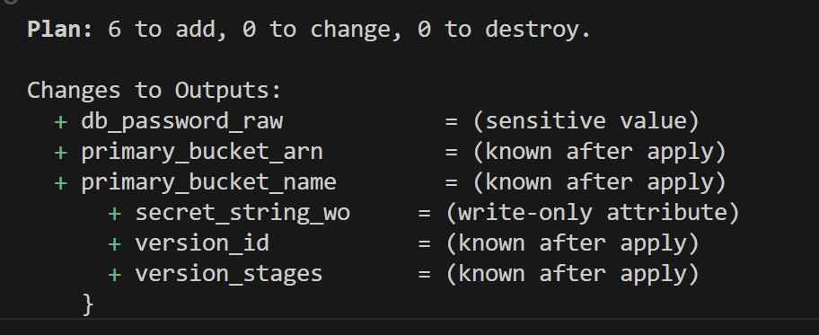
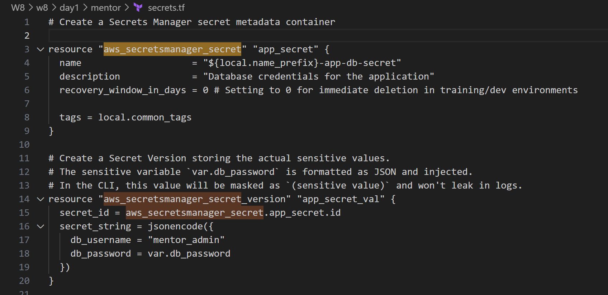

# Minh chứng: Quản lý Secrets (Dữ liệu nhạy cảm) trong Terraform

Tài liệu này cung cấp minh chứng và hướng dẫn về cách xử lý an toàn các dữ liệu nhạy cảm (secrets) trong dự án Terraform này.

---

## 1. Biến đầu vào Nhạy cảm (`sensitive = true`)
Trong file `variables.tf`, chúng ta đã khai báo:
```hcl
variable "db_password" {
  type        = string
  description = "Mật khẩu database mẫu để minh họa cách xử lý dữ liệu nhạy cảm"
  sensitive   = true
  default     = "SuperSecretPassword123!"
}
```
Việc đặt `sensitive = true` sẽ ngăn Terraform hiển thị giá trị của biến này trong đầu ra của lệnh `terraform plan` hoặc `terraform apply`.

## 2. Ẩn giá trị Output (`sensitive = true`)
Trong file `outputs.tf`, nếu muốn hiển thị mật khẩu hoặc bất kỳ thông tin xác thực nào được dẫn xuất từ nó, chúng ta phải khai báo output đó là nhạy cảm (`sensitive = true`). Nếu thiếu thuộc tính này, Terraform sẽ báo lỗi khi biên dịch.
```hcl
output "db_password_raw" {
  description = "Output mật khẩu database (sẽ bị ẩn đi trên terminal)"
  value       = var.db_password
  sensitive   = true
}
```

Khi chạy lệnh `terraform output`, bạn sẽ thấy giá trị được ẩn đi.

---

## 3. Các phương pháp tốt nhất (Best Practices) để truyền Secrets
Để tránh việc đẩy (commit) các secrets lên hệ thống quản lý mã nguồn (Git), hãy sử dụng các phương pháp sau:

### Phương pháp A: Sử dụng Biến Môi trường (Environment Variables)
Đặt tiền tố `TF_VAR_` trước bất kỳ tên biến nào được định nghĩa trong mã HCL. Terraform sẽ tự động đọc giá trị đó.
```bash
# Thiết lập mật khẩu trong môi trường terminal trước khi chạy terraform
set TF_VAR_db_password="MyUltraSecurePassword2026!"
terraform plan
```

### Phương pháp B: File chứa biến (`.tfvars`)
Lưu trữ các secrets trong một file có tên là `terraform.tfvars` hoặc `secret.tfvars` và thêm file này vào `.gitignore` để tránh commit lên Git:
```hcl
# secret.tfvars (KHÔNG commit file này lên Git!)
db_password = "AnotherSecurePassword123"
```
Khi chạy terraform, chỉ định file biến này:
```bash
terraform plan -var-file="secret.tfvars"
```

### Phương pháp C: Truy vấn động qua AWS Secrets Manager (Khuyên dùng)
Thay vì truyền thông tin xác thực qua biến, hãy tham chiếu chúng bằng cách sử dụng `data source` trong code:
```hcl
data "aws_secretsmanager_secret_version" "db_credentials" {
  secret_id = "mentor/dev/db_credentials"
}

locals {
  db_credentials = jsondecode(data.aws_secretsmanager_secret_version.db_credentials.secret_string)
}

```

Phương thức này được áp dụng và cấu hình trong file `secrets.tf` của dự án.
