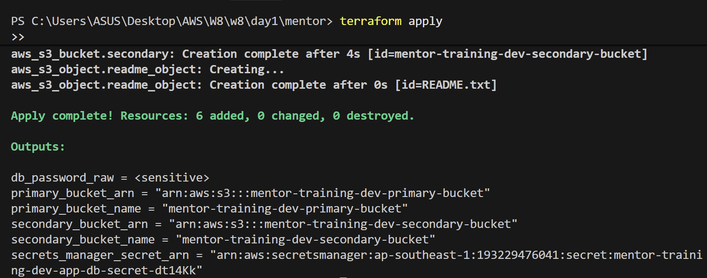
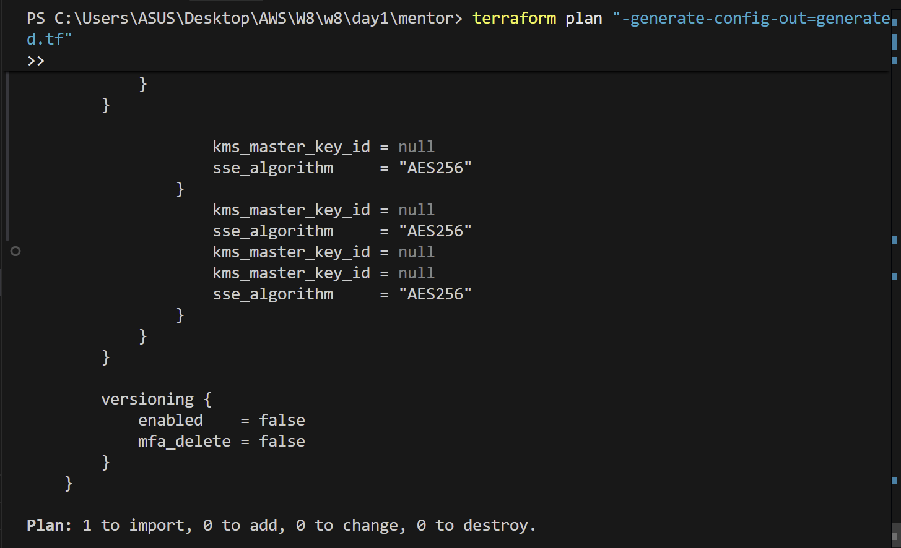
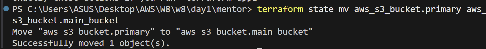
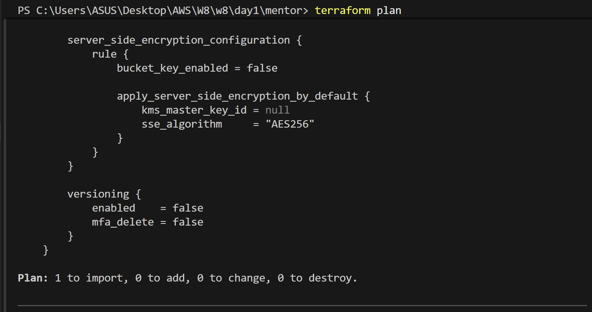
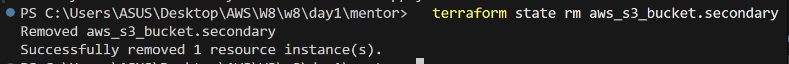
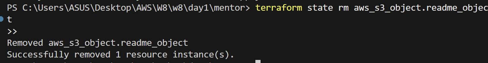
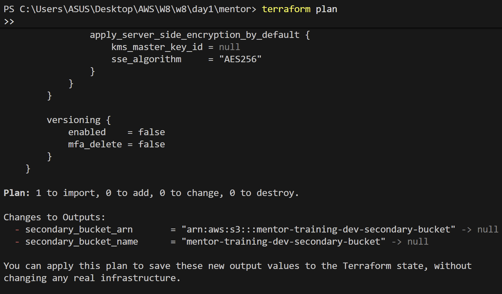

# Minh chứng: Quản lý State & Import trong Terraform

Tài liệu này cung cấp minh chứng và hướng dẫn cho việc quản lý trạng thái (state) của Terraform: import các tài nguyên đang có sẵn, di chuyển tài nguyên bên trong state, và gỡ bỏ việc theo dõi tài nguyên ra khỏi state.

---

## 1. Sử dụng Khối Import Khai báo (HCL-native Import, từ Terraform 1.5+)
Terraform 1.5 giới thiệu block `import`. Việc này giúp chúng ta import tài nguyên bằng khai báo trong file code thay vì dùng các câu lệnh CLI trước đây (`terraform import`), giúp quá trình import có thể được xem xét (review) thông qua Pull Request.

### Cấu hình mẫu:
Tạo một file tên là `imports.tf` trong thư mục gốc của module:

```hcl
# imports.tf
import {
  # Địa chỉ của tài nguyên được khai báo trong code HCL của bạn
  to = aws_s3_bucket.imported_bucket

  # Định danh AWS duy nhất của tài nguyên hiện có (Ví dụ: Tên S3 Bucket)
  id = "ten-bucket-da-ton-tai-san"
}

# Khai báo HCL tương ứng phải tồn tại trong code của bạn, hoặc được tạo tự động:
resource "aws_s3_bucket" "imported_bucket" {
  bucket        = "ten-bucket-da-ton-tai-san"
  force_destroy = true
}
```

### Các bước thực hiện Import:
1. Viết block `import` như trên.
2. Chạy lệnh tạo tự động code HCL (tùy chọn, nếu bạn không muốn tự tay viết block khai báo `resource`):
   ```bash
   terraform plan -generate-config-out=generated.tf
   ```
3. Chạy lệnh plan và apply để nạp tài nguyên vào file `.tfstate`:
   ```bash
   terraform plan
   # Đảm bảo plan hiển thị hành động import: "1 to import, 0 to add, 0 to change, 0 to destroy"
   terraform apply
   ```

### Kết quả chạy thực tế (Minh chứng Import):
Sau khi cấu hình khối `import` trỏ tới bucket `mentor-training-dev-primary-bucket` và chạy lệnh plan sinh code:

1. **Lệnh thực thi:**
   ```powershell
   terraform plan "-generate-config-out=generated.tf"
   ```

---

## 2. Di chuyển tài nguyên trong State (`terraform state mv`)
Nếu bạn đổi tên một khối khai báo tài nguyên trong file `.tf` của mình (ví dụ: đổi tên từ `aws_s3_bucket.primary` thành `aws_s3_bucket.main_bucket`)
=>  Terraform mặc định sẽ hiểu là bạn muốn **hủy** (destroy) tài nguyên cũ và **tạo mới** (create) một tài nguyên khác.

Để tránh việc tài nguyên thực tế bị xóa và chỉ cập nhật lại tên theo dõi trong state:

### Kịch bản (Scenario):
Bạn thay đổi code HCL từ:
```hcl
resource "aws_s3_bucket" "primary" { ... }
```
sang:
```hcl
resource "aws_s3_bucket" "main_bucket" { ... }
```

### Câu lệnh chạy:
Di chuyển định danh theo dõi trong file state sang tên mới bằng lệnh:
```bash
terraform state mv aws_s3_bucket.primary aws_s3_bucket.main_bucket

```


Sau khi thực hiện lệnh này, khi chạy `terraform plan` bạn sẽ thấy kết quả là **0 thay đổi** (0 changes)

---

## 3. Gỡ bỏ theo dõi tài nguyên khỏi State (`terraform state rm`)
Nếu bạn muốn dừng quản lý một tài nguyên bằng Terraform nhưng **không** muốn tài nguyên đó bị xóa trên AWS:

### Kịch bản (Scenario):
Bạn muốn bàn giao S3 bucket phụ (`aws_s3_bucket.secondary`) cho một hệ thống hoặc đội ngũ khác quản lý, giữ nguyên bucket thực tế hoạt động và xóa phần code HCL của bucket đó.

### Các bước thực hiện:
1. Xóa thông tin theo dõi tài nguyên đó trong database `.tfstate`:
   ```bash
   terraform state rm aws_s3_bucket.secondary
   terraform state rm aws_s3_object.readme_object
   ```
   
   
2. Xóa bỏ khối khai báo tài nguyên tương ứng trong file `s3.tf` của bạn.
3. Chạy lệnh plan để xác nhận Terraform đã ngừng theo dõi và không cố gắng xóa nó nữa:
   ```bash
   terraform plan
   ```
   
